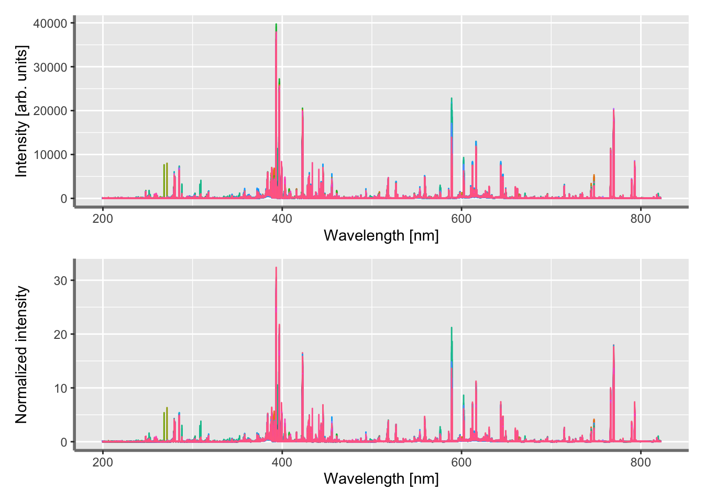
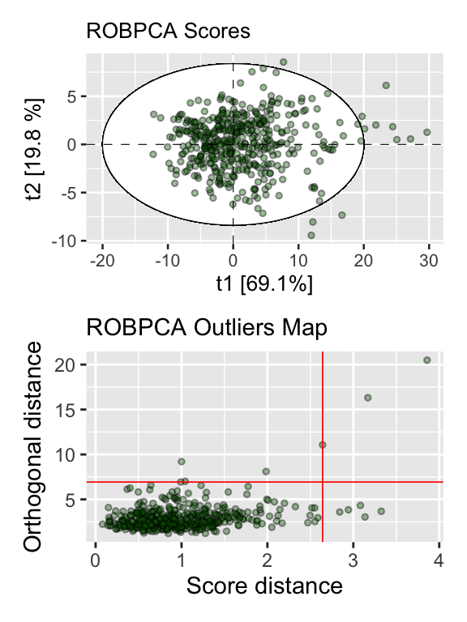
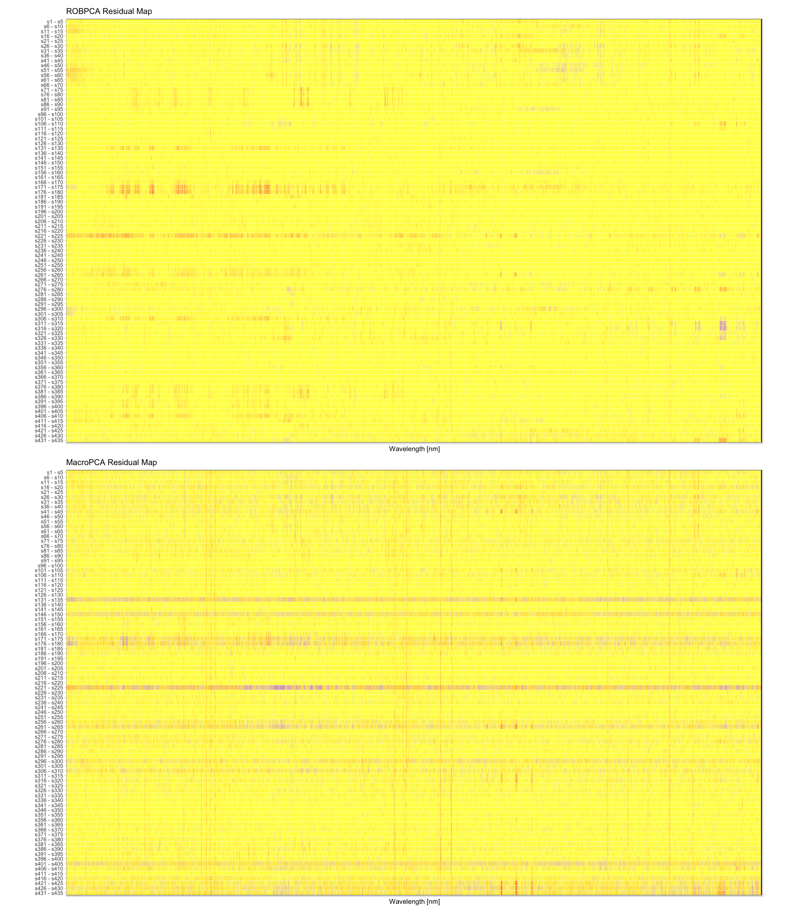

<!-- README.md is generated from README.Rmd. Please edit that file -->

# Cellwise Outliers Detection in Optical Emission Spectroscopy: An Overview of MacroPCA

<!-- badges: start -->
<!-- badges: end -->

Rowwise outliers detection is the most common actions most
spectroscopists and chemometricians take to deal with discordant
reading. However, alternative method such as MacroPCA enables to account
for cellwise outliers in spectroscopic analysis. Herein, we compare
three robust PCA-based methods namely ROSPCA, ROBPCA and MacroPCA for
detecting outliers in laser-induced breakdown spectroscopy (LIBS)
spectra of plant tissue samples.

Loading of LIBS spectra of various samples of plant materials. Plant
samples were cleaned, dried, homogenized and grounded prior LIBS
analysis.

``` r
bc_spec <- arrow::read_parquet("bc_spec.parquet")
```

Visualization of LIBS spectra of plant samples. The spectra have been
normalized to reduce pulse-to-pulse fluctuations.

``` r
plotSpec <- function(data) {
  data %>%
  select(supplier_id, spectra_id, all_of(wavelength_var)) %>%
  pivot_longer(
    cols = !c(supplier_id, spectra_id),
    names_to = "wavelength",
    values_to = "intensity"
    ) %>%
  modify_at("wavelength", as.numeric) %>%
  ggplot(aes(x = wavelength, y = intensity)) +
  geom_line(aes(color = supplier_id, group = spectra_id)) +
  labs(x = "Wavelength [nm]", y = "Intensity [arb. units]") +
  theme(
    legend.position = "none",
    axis.line = element_line(colour = "grey50", size = 1)
    )
}
```

``` r
plot1 <- plotSpec(data = bc_spec)
plot2 <- plotSpec(data = norm_spec) + labs(y = "Normalized intensity")
```

``` r
plot1 / plot2
```



### ROBPCA method

We first performed ROBPCA for detecting rowwise outliers.

``` r
set.seed(010)
robpca_mod <- norm_spec %>%
  select(all_of(wavelength_var)) %>%
  scale(center = TRUE, scale = FALSE) %>%
  as.matrix() %>%
  rospca::robpca(
    k = 0,
    kmax = 5,
    alpha = 0.75,
    h = NULL,
    mcd = FALSE,
    ndir = 5000,
    skew = TRUE
    )
```

``` r
conf_ellipse <- norm_spec %>%
  select(supplier_id, spectra_id) %>%
  bind_cols(pluck(robpca_mod, "scores") %>% as_tibble()) %>%
  select(PC1, PC2) %>%
  HotellingEllipse::ellipseParam(k = 2, pcx = 1, pcy = 2)
```

``` r
plot3 <- norm_spec %>%
  select(supplier_id, spectra_id) %>%
  bind_cols(pluck(robpca_mod, "scores") %>% as_tibble()) %>%
  ggplot(aes(x = PC1, y = PC2)) +
  ggforce::geom_ellipse(aes(x0 = 0, y0 = 0, a = pluck(conf_ellipse, "Ellipse", "a.99pct"), b = pluck(conf_ellipse, "Ellipse", "b.99pct"), angle = 0), size = .2, linetype = "solid", fill = "white") +
  geom_point(alpha = 2/5, shape = 21, size = 3, fill = "darkgreen") +
  geom_hline(yintercept = 0, linetype = "dashed", size = 0.2) +
  geom_vline(xintercept = 0, linetype = "dashed", size = 0.2) +
  labs(subtitle = "ROBPCA Scores", x = "t1 [69.1%]", y = "t2 [19.8 %]") +
  theme_grey(base_size = 10) +
  theme(legend.position = "none")
```

``` r
plot4 <- norm_spec %>%
  select(supplier_id, spectra_id) %>%
  bind_cols(tibble(sd = pluck(robpca_mod, "sd"), od = pluck(robpca_mod, "od"))) %>%
  ggplot(aes(x = sd, y = od)) +
  geom_point(alpha = 2/5, shape = 21, size = 3, fill = "darkgreen") +
  geom_hline(yintercept = pluck(robpca_mod, "cutoff.od"), linetype = "solid", color = "red", size = 0.3) +
  geom_vline(xintercept = pluck(robpca_mod, "cutoff.sd"), linetype = "solid", color = "red", size = 0.3) +
  labs(subtitle = "ROBPCA Outliers Map", x = "Score distance", y = "Orthogonal distance") +
  theme(legend.position = "none")
```

``` r
plot3 / plot4 
```



### Comparing ROBPCA and MacroPCA methods

The best way to compare the two methods is to plot their respective
cellMap. A cellmap is a powerful display of cells that are unusual. More
specifically, unusually large cell values are colored in red whilst
unusually low cell values are colored in blue. Moreover, a large number
of unusual cells values on a single row will tend to contaminate the
entire row making the observation flagged as an outlier.

``` r
ROBPCAindrows <- which(robpca_mod$od > robpca_mod$cutoff.od)
Xhat <- sweep(robpca_mod$scores %*% t(robpca_mod$loadings), 2, robpca_mod$center, "+")
```

``` r
rem_cranberry <- norm_spec %>%
  select(all_of(wavelength_var)) %>%
  scale(center = TRUE, scale = FALSE) %>%
  as.matrix()
```

``` r
Xresid <- rem_cranberry - Xhat
scaleRes <- cellWise::estLocScale(Xresid, type = "1stepM", center = F)$scale
#> Warning in cellWise::estLocScale(Xresid, type = "1stepM", center = F): 1  out of  7152  variables have an estimated scale <= 
#> "precScale" =  1e-12 .
stdResidROBPCA <- sweep(Xresid, 2, scaleRes, "/")
```

``` r
cutoffResid <- sqrt(qchisq(0.99, df = 1))
ROBPCAindcells <- which(abs(stdResidROBPCA) > cutoffResid)
```

``` r
plot5 <- cellWise::cellMap(
  D = rem_cranberry,
  R = stdResidROBPCA,
  indcells = ROBPCAindcells,
  indrows = ROBPCAindrows,
  showVals = NULL,
  rowlabels = paste0("s", 1:nrow(rem_cranberry)),
  columnlabels = NULL,
  rowtitle = "",                       
  columntitle = "",
  nrowsinblock = 5,
  ncolumnsinblock = 10,
  adjustcolumnlabels = 0.5,
  sizetitles = 1,
  colContrast = 1.2,
  outlyingGrad = TRUE,
  drawCircles = FALSE
  ) +
  coord_fixed(ratio = 5) +
  labs(title = "ROBPCA Residual Map", x = "Wavelength [nm]", y = "Plant Sample") +
  theme_light(base_size = 8) +
  theme(
    legend.position = "none",
    panel.grid.major = element_blank(), 
    panel.grid.minor = element_blank(),
    axis.text.x = element_blank()
    )
```

``` r
plot6 <- cellWise::cellMap(
  D =  pluck(macroPCA_mod, "remX"),
  R = pluck(macroPCA_mod, "stdResid"), 
  indcells = pluck(macroPCA_mod, "indcells"), 
  indrows = pluck(macroPCA_mod, "indrows"),
  showVals = NULL,
  rowlabels = paste0("s", 1:nrow(norm_spec)),
  columnlabels = round(as.numeric(wavelength), 2),
  rowtitle = "",
  columntitle = "",
  nrowsinblock = 5, 
  ncolumnsinblock = 10,
  adjustcolumnlabels = 0.5,
  sizetitles = 1,
  colContrast = 1.2,
  outlyingGrad = TRUE,
  drawCircles = FALSE
  ) +
  coord_fixed(ratio = 5) +
  labs(title = "MacroPCA Residual Map", x = "Wavelength [nm]", y = "Plant Sample") +
  theme_light(base_size = 8) +
  theme(
    legend.position = "none",
    panel.grid.major = element_blank(), 
    panel.grid.minor = element_blank(),
    axis.text.x = element_blank()
    )
```

``` r
plot5 / plot6
```


