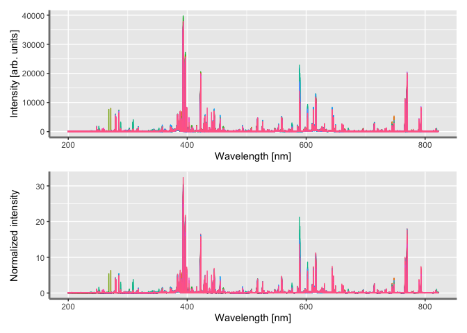

<!-- README.md is generated from README.Rmd. Please edit that file -->

# Cellwise Outliers Detection in Optical Emission Spectroscopy: An Overview of MacroPCA

<!-- badges: start -->
<!-- badges: end -->

Rowwise outliers detection is the most common actions most
spectroscopists and chemometricians take to deal with discordant
reading. However, alternative method such as MacroPCA enables to account
for cellwise outliers in spectroscopic analysis.

``` r
bc_spec <- arrow::read_parquet("bc_spec.parquet")
```

``` r
plot1 <- plotScpec(data = bc_spec)
plot2 <- plotScpec(data = norm_spec) + labs(y = "Normalized intensity")
```

``` r
plot1 / plot2
```

<!-- -->
