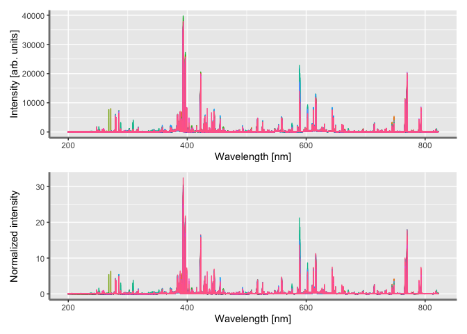

<!-- README.md is generated from README.Rmd. Please edit that file -->

# Cellwise-Outliers-Detection-in-Optical-Emission-Spectroscopy

<!-- badges: start -->
<!-- badges: end -->

The goal of Cellwise-Outliers-Detection-in-Optical-Emission-Spectroscopy
is to …

``` r
ssh = suppressPackageStartupMessages
ssh(library(tidyverse))
ssh(library(magrittr))
library(HotellingEllipse)
library(data.table)
#> 
#> Attaching package: 'data.table'
#> The following objects are masked from 'package:dplyr':
#> 
#>     between, first, last
#> The following object is masked from 'package:purrr':
#> 
#>     transpose
library(patchwork)
```

``` r
bc_spec <- arrow::read_parquet("bc_spec.parquet")
```

``` r
wavelength_var <- bc_spec %>%
  select(-c(qr_code:timestamp)) %>%
  names() %>%
  as.character()
```

``` r
plotScpec <- function(data) {
  data %>%
  select(supplier_id, spectra_id, all_of(wavelength_var)) %>%
  pivot_longer(
    cols = !c(supplier_id, spectra_id),
    names_to = "wavelength",
    values_to = "intensity"
    ) %>%
  modify_at("wavelength", as.numeric) %>%
  ggplot(aes(x = wavelength, y = intensity)) +
  geom_line(aes(color = supplier_id, group = spectra_id)) +
  labs(x = "Wavelength [nm]", y = "Intensity [arb. units]") +
  theme(
    legend.position = "none",
    axis.line = element_line(colour = "grey50", size = 1)
    )
}
```

``` r
plot1 <- plotScpec(data = bc_spec)
```

``` r
norm_spec <- bc_spec %>%
  select(all_of(wavelength_var)) %>%
  mutate(across(.cols = everything(), .fns = ~.x/`247.8433039`)) %>%
  bind_cols(select(bc_spec, -all_of(wavelength_var)), .)
```

``` r
plot2 <- plotScpec(data = norm_spec) + labs(y = "Normalized intensity")
```

``` r
plot1 / plot2
```

<!-- -->
